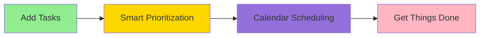
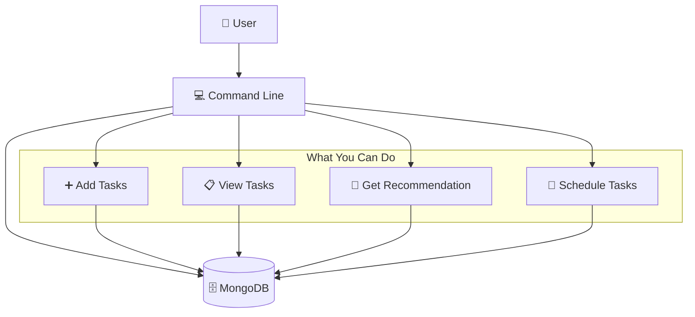
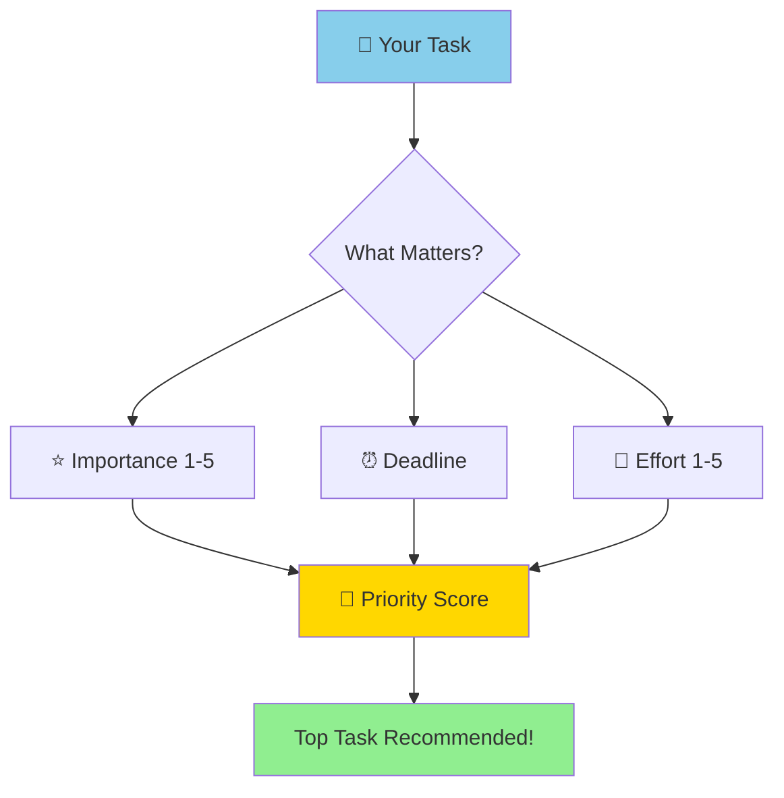
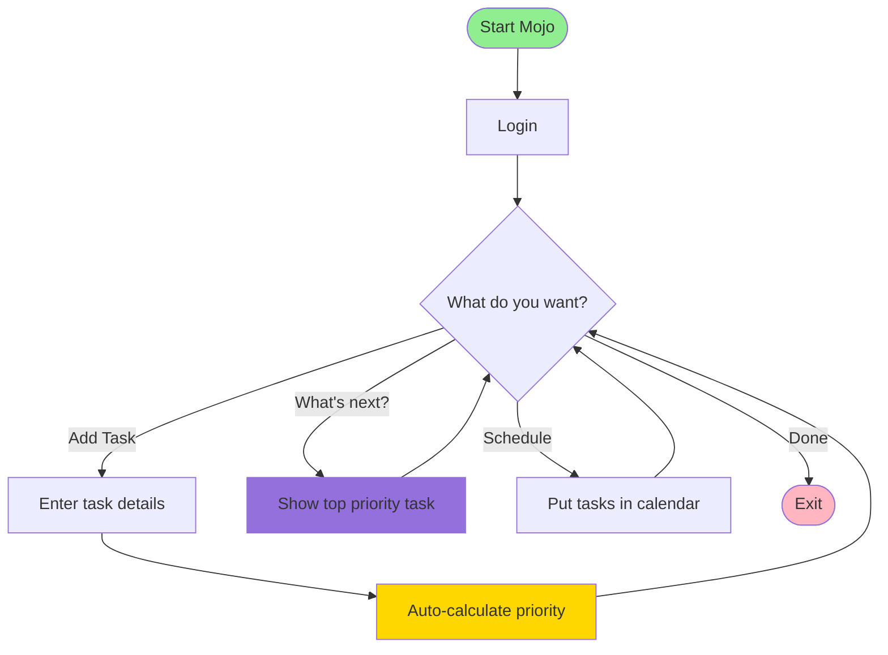
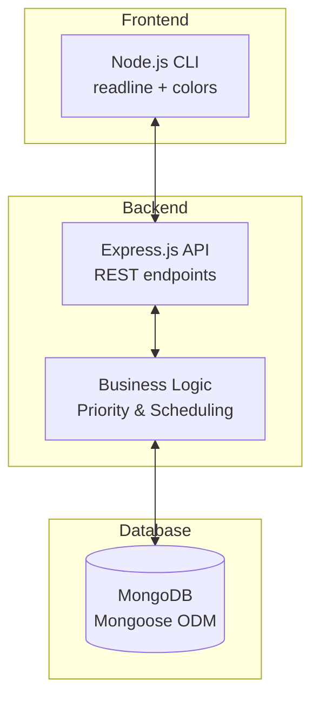

# Mojo Workflow

> **Mojo** is a task manager that automatically prioritizes your work and schedules it into your calendar.

## What Mojo Does



Mojo helps you answer: **"What should I work on next?"**

---

## System Overview



**Three Simple Steps:**
1. Add your tasks (with importance and deadlines)
2. Ask Mojo what to work on next
3. Schedule tasks into your calendar

---

## How Tasks Are Prioritized



**Example:**
- "Finish report" (Importance: 5, Due: Tomorrow) → **High Priority** ⚡
- "Read article" (Importance: 2, Due: Next month) → **Low Priority**

---

## Basic Workflow



---

## Project Structure

```
Mojo/
├── src/
│   ├── models/          # Database schemas
│   │   ├── User.js      # User accounts
│   │   ├── Task.js      # Tasks with priority scores
│   │   └── TaskSchedule.js  # Calendar slots
│   │
│   ├── services/        # Core logic
│   │   ├── priority.js      # Task ranking algorithm
│   │   ├── planner.js       # Calendar scheduling
│   │   └── suggestions.js   # Task recommendations
│   │
│   ├── cli.js           # Interactive command-line interface
│   └── server.js        # Express API server
│
└── data/                # MongoDB data
```

---

## Key Features

### 🎯 Smart Prioritization
Tasks are scored based on:
- **Importance**: How critical is it? (1-5)
- **Urgency**: When is it due?
- **Effort**: How much work? (1-5)

### 🏷️ Auto-Tagging
Mojo detects categories automatically:
- "Finish assignment" → `study` tag
- "Go to gym" → `health` tag
- "Fix bug" → `work` tag

### 📅 Calendar Planning
Schedule tasks around:
- Your working hours (9 AM - 6 PM)
- Busy blocks (meetings, appointments)
- Routine times (morning routine, lunch breaks)

### 💡 Task Suggestions
Mojo suggests new tasks based on your profile:
- If you prioritize `health`, it suggests fitness tasks
- If you prioritize `work`, it suggests project tasks

---

## Tech Stack



**Technologies:**
- **Node.js** - JavaScript runtime
- **Express** - Web server/API
- **MongoDB** - Database
- **Mongoose** - Database models
- **bcrypt** - Password security

---

## Quick Start

```bash
# 1. Start MongoDB
sudo service mongod start

# 2. Start the server
node src/server.js

# 3. Run the CLI (in new terminal)
npm run cli
```

That's it! Now you can add tasks and get smart recommendations.

---

> 📚 **Want more detail?** Check out `WORKFLOW_DETAILED.md` for comprehensive flowcharts and architecture diagrams.
