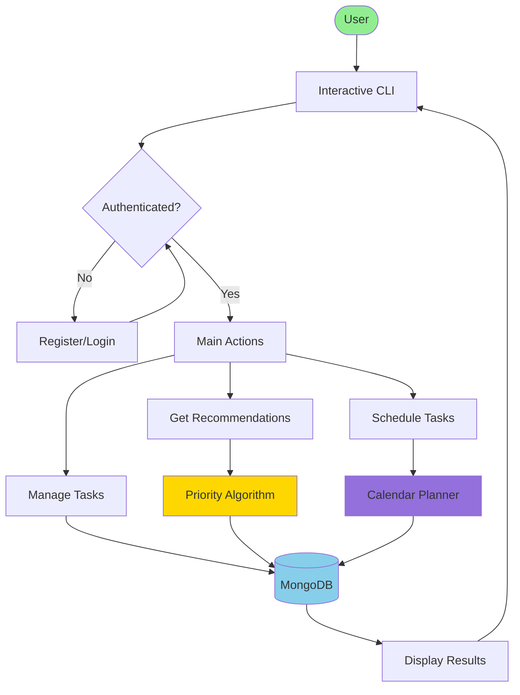
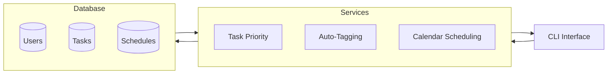
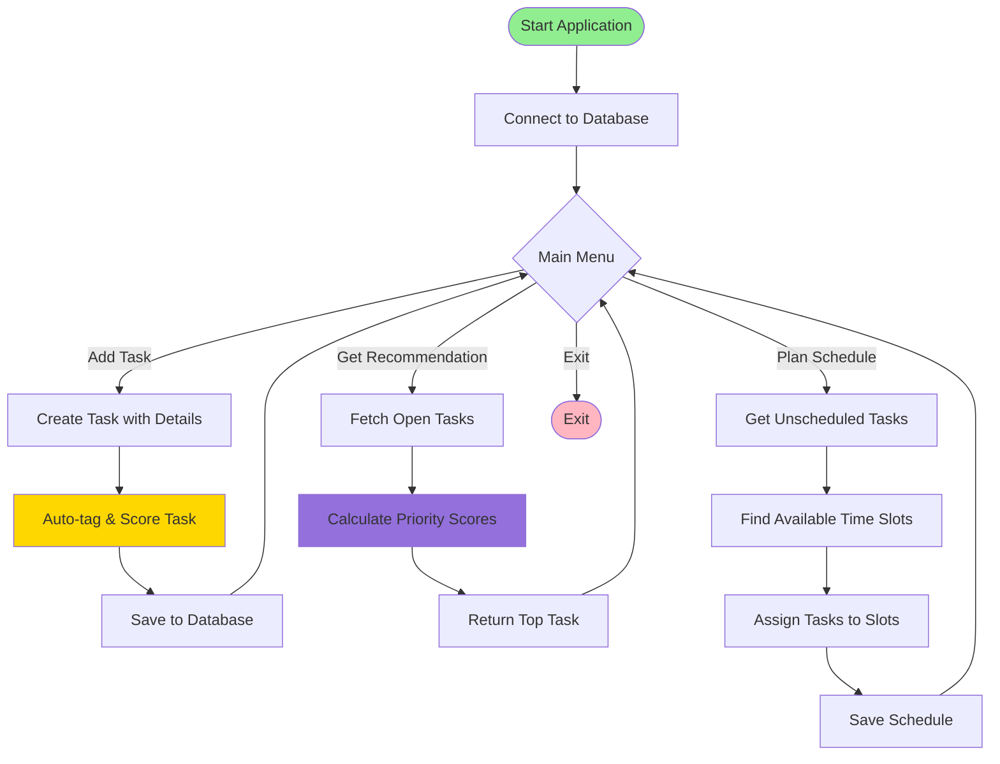
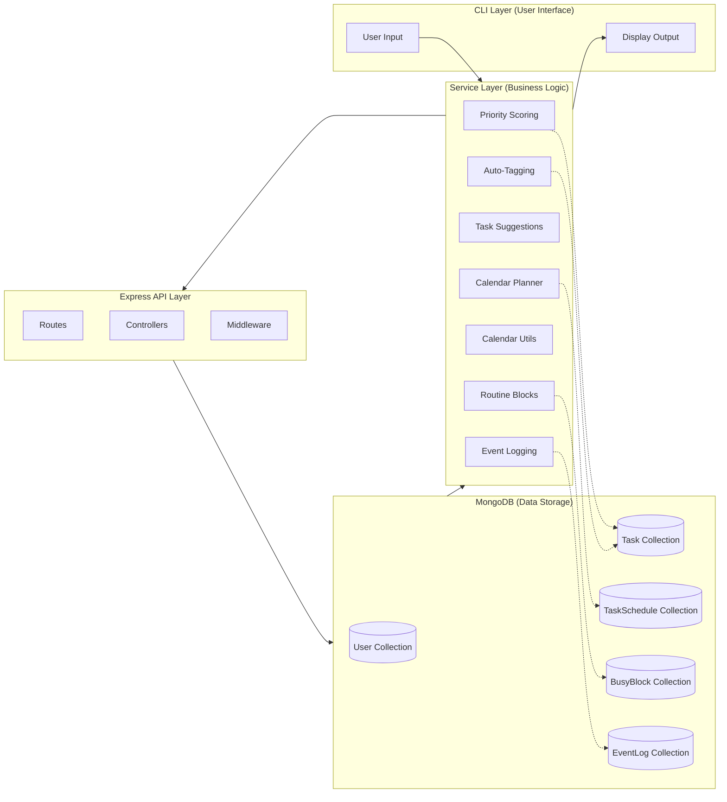
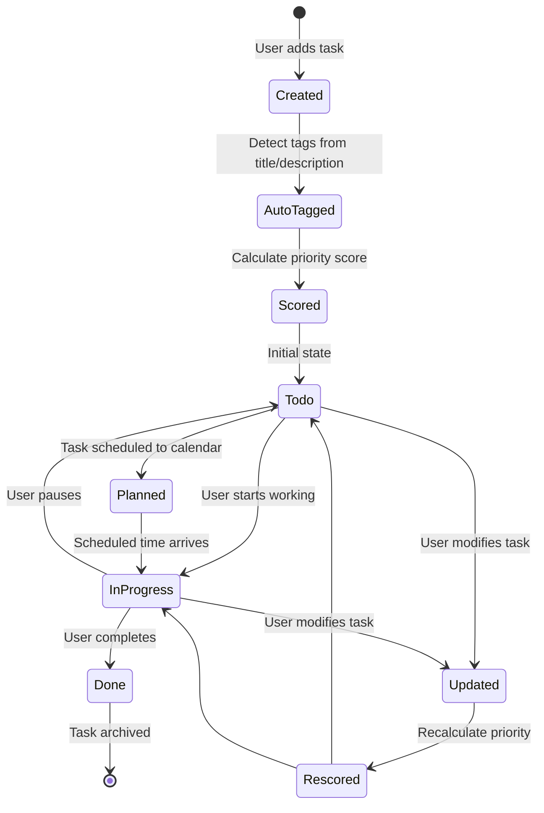
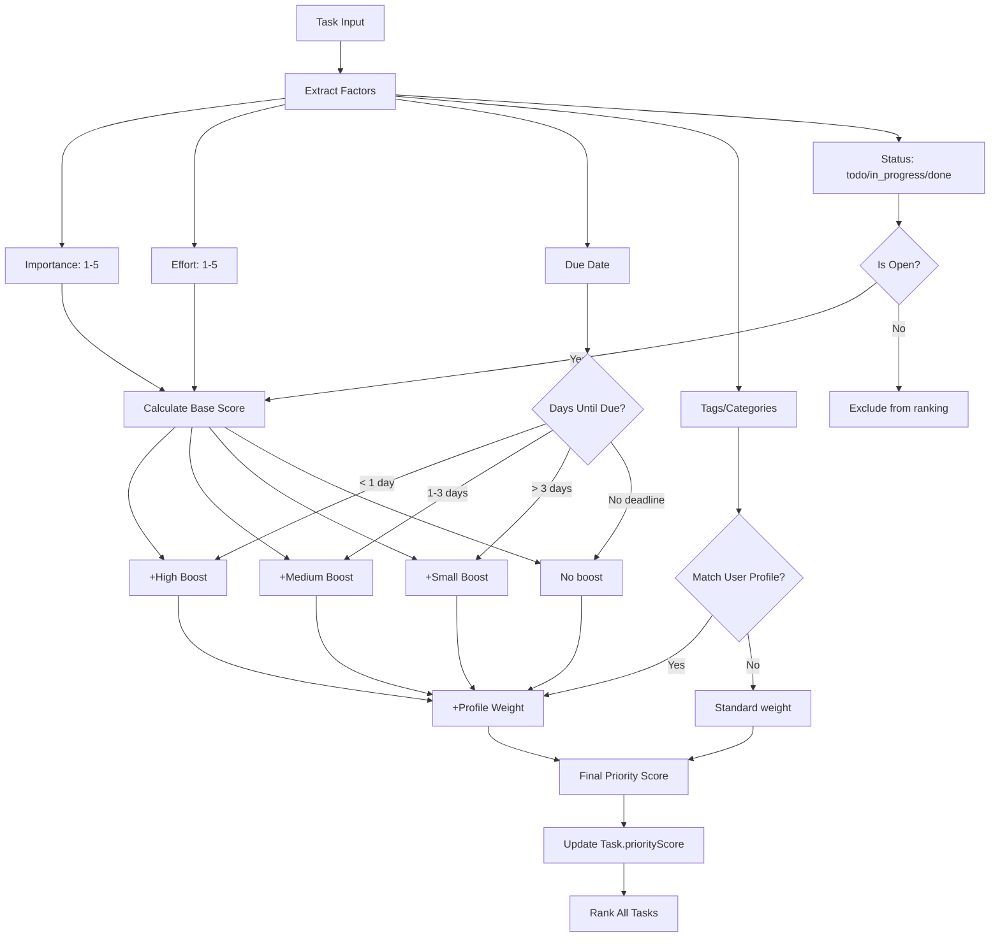
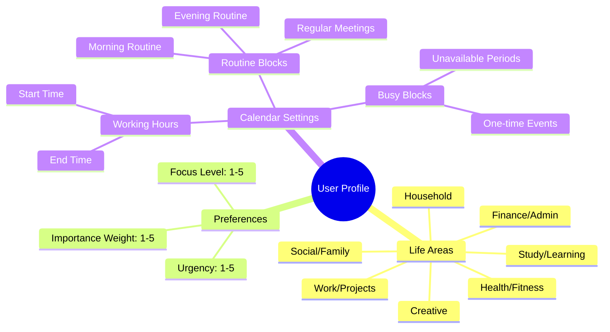

# Mojo Workflow Flowchart

> **Mojo** is a productivity coaching system that helps users manage tasks, get intelligent recommendations, and schedule work efficiently.

## High-Level System Overview

<!-- This diagram shows the main user flow: authentication → core actions → database interaction -->

**Key Points:**
- Users interact through a command-line interface
- Three main operations: task management, recommendations, and scheduling
- All data persists in MongoDB

## Simple Architecture

<!-- Standard 3-tier architecture: Presentation → Business Logic → Data Storage -->

**Core Services:**
- **Task Priority**: Scores tasks based on importance, effort, and deadlines
- **Auto-Tagging**: Detects categories (work, study, health, etc.) from task descriptions
- **Calendar Scheduling**: Allocates tasks to available time slots

## Core Workflow

<!-- The main event loop showing the three primary user actions -->

**How It Works:**

1. **Add Task**: User enters task details (title, importance 1-5, effort 1-5, due date). System automatically detects tags and calculates priority score.

2. **Get Recommendation**: System analyzes all open tasks and recommends which one to work on next based on urgency, importance, and user preferences.

3. **Plan Schedule**: System places tasks into the user's calendar, respecting working hours, busy blocks, and routine time slots (like morning routines or regular meetings).

---

## Detailed System Architecture

```mermaid
flowchart TB
    Start([User Starts CLI]) --> Connect[Connect to MongoDB]
    Connect --> Menu[Display Main Menu]
    
    Menu --> Choice{User Choice}
    
    %% Authentication Flow
    Choice -->|1. Register| Reg[Enter Username & Password]
    Reg --> HashPwd[Hash Password with bcrypt]
    HashPwd --> SaveUser[Save User to MongoDB]
    SaveUser --> Profile[Complete Preference Questionnaire]
    Profile --> Menu
    
    Choice -->|2. Login| Login[Enter Credentials]
    Login --> VerifyPwd{Verify Password}
    VerifyPwd -->|Invalid| LoginFail[Show Error]
    LoginFail --> Menu
    VerifyPwd -->|Valid| SetSession[Set Current User]
    SetSession --> Menu
    
    %% Task Management Flow
    Choice -->|3. Add Task| AddTask[Enter Task Details]
    AddTask --> TaskDetails[Title, Description, Importance, Effort, Due Date]
    TaskDetails --> AutoTag[Auto-detect Tags]
    AutoTag --> SaveTask[Save Task to MongoDB]
    SaveTask --> UpdateScores[Trigger Priority Score Update]
    UpdateScores --> Menu
    
    Choice -->|4. List Tasks| FetchTasks[Query User's Tasks from DB]
    FetchTasks --> DisplayTasks[Display All Tasks with Details]
    DisplayTasks --> Menu
    
    %% Recommendation Flow
    Choice -->|5. Recommend Next Task| GetOpenTasks[Fetch Open Tasks]
    GetOpenTasks --> ScoreTasks[Score Activities with Priority Algorithm]
    ScoreTasks --> CalcFactors[Calculate: Importance + Effort + Deadline + Tags]
    CalcFactors --> RankTasks[Rank Tasks by Score]
    RankTasks --> ShowTop[Display Top Recommended Task]
    ShowTop --> Menu
    
    %% Suggestion Flow
    Choice -->|6. Suggest New Task| GetProfile[Load User Profile & Preferences]
    GetProfile --> AnalyzeProfile[Analyze Life Areas: Work, Study, Health, etc.]
    AnalyzeProfile --> SuggestTask[Generate Task Suggestion]
    SuggestTask --> ShowSuggestion[Display Suggestion to User]
    ShowSuggestion --> Menu
    
    %% Planning Flow
    Choice -->|7. Plan Tasks| SelectTasks[Select Tasks to Schedule]
    SelectTasks --> LoadCalendar[Load Busy Blocks & Routines]
    LoadCalendar --> FindFreeSlots[Calculate Free Time Intervals]
    FindFreeSlots --> AllocateTime[Allocate Task Durations to Slots]
    AllocateTime --> SaveSchedule[Persist TaskSchedule to DB]
    SaveSchedule --> ShowPlan[Display Planned Schedule]
    ShowPlan --> Menu
    
    %% Schedule Management Flow
    Choice -->|8. View Schedule| QuerySchedule[Query TaskSchedule from DB]
    QuerySchedule --> DisplaySchedule[Display Upcoming Sessions]
    DisplaySchedule --> Menu
    
    Choice -->|9. Update Schedule| SelectSession[Select Schedule Entry]
    SelectSession --> ModifySession[Mark as Done/Skipped or Adjust Time]
    ModifySession --> UpdateDB[Update TaskSchedule in DB]
    UpdateDB --> Menu
    
    %% Calendar Constraints Flow
    Choice -->|10. Calendar Constraints| CalendarMenu{Calendar Submenu}
    CalendarMenu -->|Set Working Hours| SetHours[Define Start/End Times]
    SetHours --> SaveHours[Save to User Profile]
    SaveHours --> Menu
    CalendarMenu -->|Manage Routines| ManageRoutine[Add/View Routine Blocks]
    ManageRoutine --> SaveRoutine[Save BusyBlock to DB]
    SaveRoutine --> Menu
    CalendarMenu -->|Back| Menu
    
    %% Exit Flow
    Choice -->|0. Exit| Cleanup[Close Database Connection]
    Cleanup --> End([Goodbye Message])
    
    style Start fill:#90EE90
    style End fill:#FFB6C1
    style Connect fill:#87CEEB
    style SaveTask fill:#FFD700
    style UpdateScores fill:#FF6B6B
    style RankTasks fill:#9370DB
    style AllocateTime fill:#20B2AA
```

<!-- Complete user journey through all CLI menu options -->

## Data Flow Architecture

<!-- Shows how data moves between different layers of the application -->

## Task Lifecycle

<!-- State machine showing how tasks transition from creation to completion -->

## Priority Scoring Algorithm

<!-- The algorithm that determines which task should be done next -->

## User Profile & Preferences

<!-- User preferences that influence task recommendations and scoring -->

